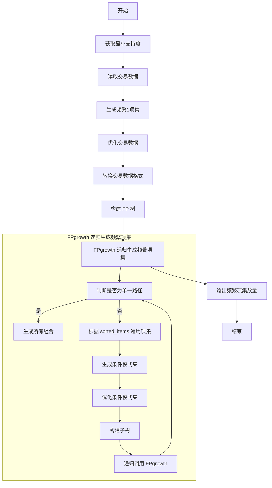

# FPgrowth 算法

## 文件说明

- `retail.dat`：超市销售记录。
- `FPgrowth.cpp`：FPgrowth 算法源码。

## 代码说明

- `vector<map<vector<int>, int>> final_L`：存储最终频繁项集的结构。
- `vector<vector<int>> Transactions`：初始存储 `retail.dat` 数据的结构，之后统一转换为 `map<vector<int>, int>` 形式。

主要数据结构：
- `Node`：表示 FP 树中的节点。
- `FPTree`：表示 FP 树的数据结构。
- `FPgrowth()`：主要算法函数。

### 关键点
- 在对销售记录按出现次数排序时，需要使用**稳定排序**：
  ```c++
  sort(new_trans.begin(), new_trans.end(), [&](int a, int b) {
      if (L.at(a) == L.at(b))
          return a < b;
      return L.at(a) > L.at(b);
  });
  ```
  这样确保同一出现次数的元素按大小排序，避免构建 FP 树时出错。

- `header table` 的顺序无关紧要，可以按任何顺序处理，不会影响最终结果。

## 流程图



## 运行效率

在 Mac M1 Pro 芯片上运行时间如下：

| 支持度百分比 | 时间（秒） | 频繁项集数量 |
|--------------|-----------|-------------|
| 0.005%       | 4s        | 1,506,775   |
| 0.004%       | 6.5s      | 4,106,008   |
| 0.003%       | 18s       | 20,647,331  |
| 0.002%       | 跑不出来，估计是爆内存了 |  |
