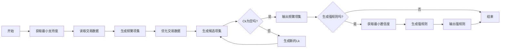

# Apriori 算法

## 文件说明

`../retail.dat` 为超市销售记录。

`src.cpp` 为源码。代码基本按照 PPT 的思路编写，在生成频繁二项集的候选集时进行了一定优化。

> 优化原因：当 support 为 0.1% 时，L1 的个数为 2117，如果将所有可能的组合存储在 C2 中，那么将会有 `2117 * 2116 / 2 = 2239786` 个集合，单纯初始化这个 C2 就需要非常长的时间。后面还要对 retail 进行逐行扫描，模式匹配，一共有八万行，每行进行模式匹配，基本不可能算出结果。

## 代码大致结构

## 运行效率

我使用的是 Mac，芯片为 M1 Pro，运行时间如下：

| 支持度百分比 | 时间（秒） |
|--------------|-----------|
| 0.2%         | 1.3s      |
| 0.1%         | 4.5s      |
| 0.05%        | 11s       |
| 0.04%        | 17.5s       |
| 0.03%        | 30.9s       |
| 0.02%        | 77s       |